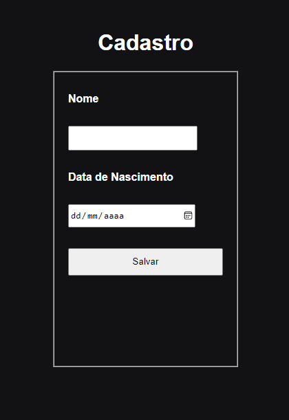

# FormDOM

**Etse repositório se trata de um formulário comum de um usuário, na qual tentei treinar melhor meus conhecimentos de classes e objetos, com tipagem de valores e variáveis em TypeScript para sair da minha zona de conforto e conseguir mudar meu estilo de programação em sentido web, utilizando também o modelo MVC de aplicação!**

O paradigma de classes e objetos é mais vantajoso, no sentido de conseguir tornar seu código bem mais legível aos programadores que irão ler o código, e ainda o TypeScript ajuda a lidar com esses valores adicionando esta tipagem, e comprometendo-se na legibilidade de bugs e erros que podem ser cometidos, ajudando no desenvolvimento de páginas web, e nesa, um formulário...

